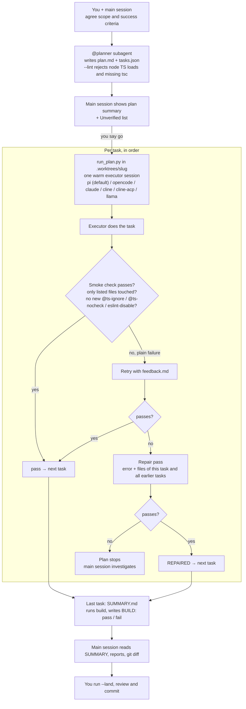

# Harness flow

- Claude cost: planner call(s) + a thin main session. The executor is free with pi or
  opencode on Bunny, with cline on its free model, or with llama on a local GGUF;
  `--executor claude` bills Claude.
- Checks: `tsc --noEmit` / one-line smoke per task. Full build only in the last task, never a gate.
- Stray files, lock edits and timeouts skip the repair pass.
- `--parallel N` is refused for `cline`, `cline-acp` and `llama` (single shared session or one
  local model slot, not thread-safe).
- Every path in table form: `FLOWS.md`.
